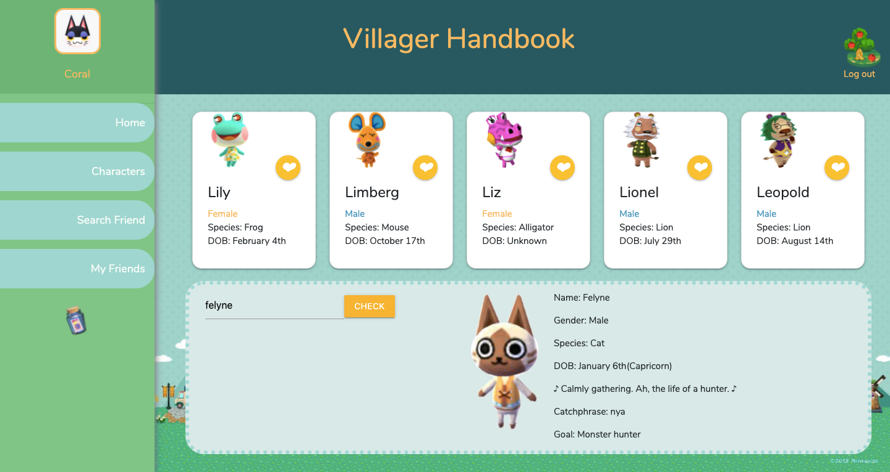

# Villager Handbook 🌴

Animal Crossing related MERN stack application.

## Description
This application will allow user to search the characters in Animal Crossing, also communicate with friends through the app by sending greeting cards.

## How to use
- **Signin/Login** 
  - New users can register by using unique email address through below signin section. After new account has been created, the users will need to enter the name and choose an avatar from the 'Villager Basic information' section.

  - Once new account has been created, users can login from the below page from the second time when they access to this website.

- **Home**
  - Home page will provide guide to new users and also show the daily event in the game. Also from the left side, user can access to different routes.

  - **Characters**
    - Users can check the characters' basic information, and the search section allows them to search the details for a specific characters
  
  - **Search Friend**
    - Users are able to search friends' email adresses and add them into the friend list
  
  - **My Friends**
    - All the friends users have added will be showed on this page. Users also can send a message/greeting card through this page
  
  - **Drift Bottle**
    - The drift bottle icon will direct users to the message list, which will display all the messages have been received from friends
  

## Functions
- **Login/Signin** 
  - Once the email and password have been entered, the information will be posted to the api route to verify.
  - From the signin page, the new registered email will be post to and save in the data base. Once the user has been registered, the update user information component will show and allow the user to update the name and avatar, which will be saved in the database.

- **Home**
  - This page display user name and avatar, which get from the database. Daily event in the game will be got from the third party api and display in the main section. 

  - **Characters**
    - Five random characters' information will be brought from the third party API. Also the search section allow users to search and check the information of any charaters in the game.
  - **Search Friend**
    - Search Friend route will allow users to search and add friend by searching emails, which the friend's information will be posted to the api route and will be displayed on the My Friend route.
  - **My Friends**
    - Friends' information got from the the database and display on this route. The 'send message' button allows user to user to post a message to friends, the message will be display in the receiver's drift bottle page.
  - **Drift Bottle**
    - The drift bottle icon will direct user to message list page, which will get the messages received from other users and listed on this route.

## Deployment
Heroku Link: https://villager-handbook.herokuapp.com/

## Acknowledge
- HTML
- CSS
  - Materialize CSS Framework
- JavaScript
  - React
  - Express
  - Express-session
  - Node
  - Nodemon
  - passport
  - bcrypt
  - redux
- MongoDB

## Author
- Sherry Jin
